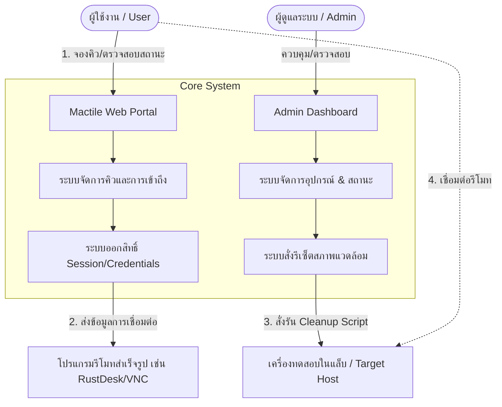

# Mactile (กลุ่ม 4) — Remote Device Lab & Queue Management System

> **Mactile** เป็นระบบศูนย์กลางในการบริหารจัดการการจองคิว การควบคุมสิทธิ์การเข้าถึงเครื่องทดสอบ/เวิร์กสเตชันในห้องแล็บระยะไกล (Target Host) ผ่านโปรแกรมรีโมทสำเร็จรูป (เช่น RustDesk, VNC, AnyDesk) พร้อมกลไกสั่งรีเซ็ตสภาพแวดล้อมเครื่องอัตโนมัติ (Environment Cleanup & Reset) และหน้า Dashboard สำหรับผู้ดูแลระบบ

---

## 📚 สารบัญเอกสารโครงการ (Project Documentation)

เอกสารข้อกำหนดและการออกแบบระบบทั้งหมดในเฟส MVP:

| เอกสาร | รายละเอียด | ลิงก์ |
| :--- | :--- | :---: |
| 📋 **Project Charter** | แผนผังและกรอบการดำเนินงานโครงการ, ที่มาและความสำคัญ, วัตถุประสงค์, ขอบเขต MVP, สถาปัตยกรรมระบบ, RACI Matrix และไทม์ไลน์ | [`docs/project_charter.md`](./docs/project_charter.md) |
| 📝 **Software Requirements Specification (SRS)** | ข้อกำหนดความต้องการทางซอฟต์แวร์ทั้ง Functional (FR) และ Non-Functional (NFR), Use Case Diagram, และ Data Schema | [`docs/requirements_specification.md`](./docs/requirements_specification.md) |
| ✅ **Acceptance Criteria & UAT** | เกณฑ์การยอมรับการส่งมอบระบบ (Definition of Done), รายละเอียดเกณฑ์ตรวจรับรายโมดูล (Gherkin Syntax), และ UAT Test Matrix | [`docs/Acceptance_criteria.md`](./docs/Acceptance_criteria.md) |
| 🗄️ **Database Design Specification** | แผนผังความสัมพันธ์ (Mermaid ERD), พจนานุกรมข้อมูล (Data Dictionary), State Machines, Concurrency Control, และ SQL DDL พร้อม Initial Seed Data | [`docs/database_design.md`](./docs/database_design.md) |

---

## 🎯 ขอบเขตการทำงานหลัก 4 โมดูล (Core MVP Modules)

1. **จองคิวและการเข้าถึง (Queue & Access Management):**
   - ตรวจสอบสถานะเครื่องแบบ Real-time (`Available`, `Busy`, `Cleaning`, `Maintenance`, `Offline`)
   - ระบบจัดสรรคิวแบบ FIFO และ Slot Booking พร้อมการป้องกันการจองซ้ำ
   - แจ้งเตือนเมื่อถึงคิว พร้อมตัวนับเวลาถอยหลัง Session Countdown Timer
2. **จัดการและรีเซ็ตสภาพแวดล้อมเบื้องต้น (Basic Environment Reset):**
   - ตัดการเชื่อมต่อทันทีเมื่อหมดเวลาหรือผู้ใช้กดยุติ Session
   - กวาดล้างไฟล์ชั่วคราว (Downloads, Desktop, Temp) และล้าง Browser Cache/Session
   - สั่ง Kill Background Processes และสุ่มหมุนเวียนรหัสผ่านรีโมทใหม่ทุกรอบ
3. **การเชื่อมต่อรีโมทด้วยโปรแกรมสำเร็จรูป (Remote Connection via Existing Tools):**
   - รองรับโปรแกรมรีโมทสำเร็จรูป เช่น RustDesk, VNC, AnyDesk
   - แจกแจง One-Time / Dynamic Credentials ให้ผู้ใช้ที่ถึงคิว พร้อมคู่มือการเชื่อมต่อ
4. **หน้า Dashboard สำหรับผู้ดูแลระบบ (Admin Dashboard):**
   - Live Device Monitoring ตรวจสอบสถานะเครื่องทั้งหมด
   - ปุ่มคำสั่ง Override: Force Terminate / Kick User, Force Reset Machine
   - ตั้งค่า Maintenance Mode และตรวจสอบ Audit Logs ย้อนหลัง

---

## 👥 สมาชิกผู้พัฒนา (กลุ่ม 4)

- โครงการ: **Mactile** (Remote Device Lab & Queue Management System)
- สมาชิกทีมพัฒนา: **กลุ่ม 4**
