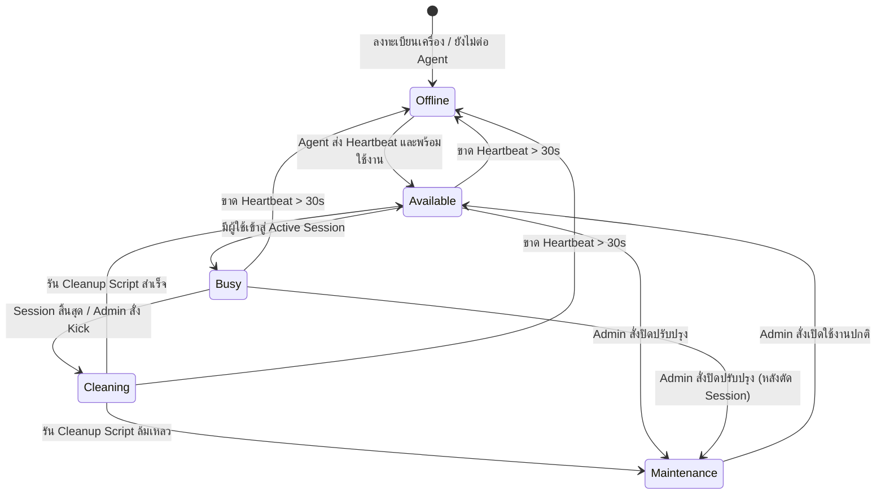
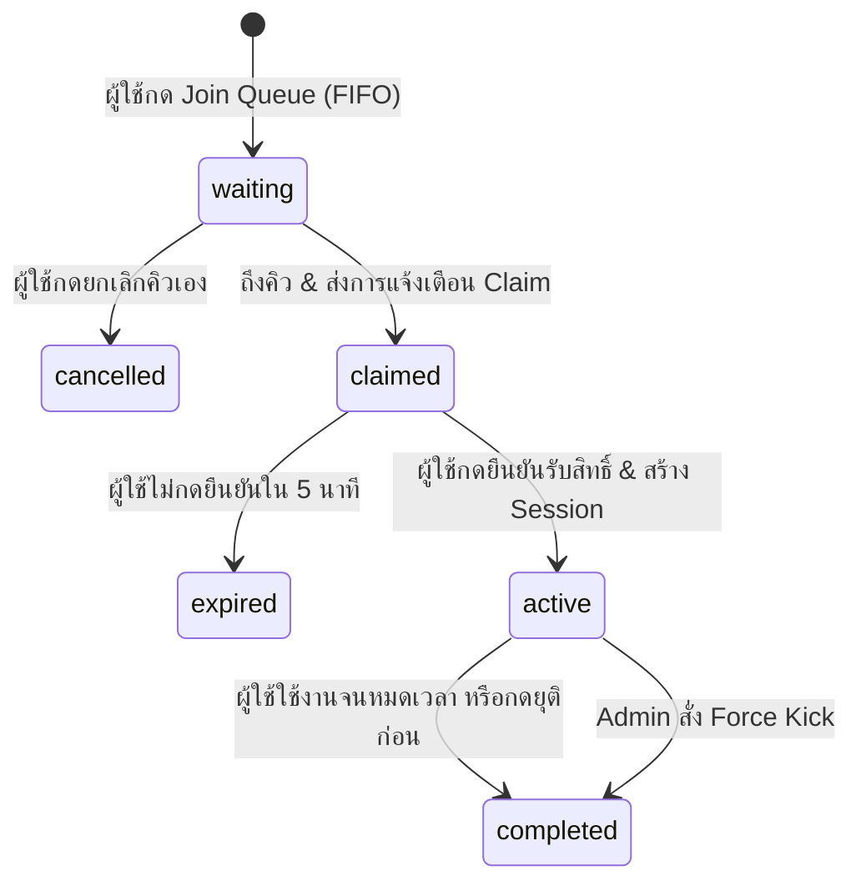

# Database Design Specification: Mactile (กลุ่ม 4) — MVP

> **ชื่อระบบ:** Mactile (Remote Device Lab & Queue Management System)  
> **กลุ่มผู้พัฒนา:** กลุ่ม 4  
> **ระดับโครงการ:** Minimum Viable Product (MVP)  
> **สถานะเอกสาร:** Approved / Active  
> **ระบบจัดการฐานข้อมูล (RDBMS):** PostgreSQL (Recommended) / SQLite 3 (Lightweight Lab Setup)  
> **วันที่จัดทำ:** 16 สิงหาคม 2026  

---

## 1. บทนำและหลักการออกแบบ (Introduction & Design Principles)

เอกสารฉบับนี้อธิบายรายละเอียดการออกแบบฐานข้อมูล (Database Schema & Architecture) สำหรับระบบ **Mactile MVP (กลุ่ม 4)** เพื่อรองรับการทำงาน 4 โมดูลหลัก ได้แก่:
1. **ระบบจองคิวและการเข้าถึง (Queue & Access Management)**
2. **การจัดการและรีเซ็ตสภาพแวดล้อมเบื้องต้น (Environment Management & Basic Reset)**
3. **การเชื่อมต่อรีโมทด้วยโปรแกรมสำเร็จรูป (Remote Connection via Existing Tools)**
4. **หน้า Dashboard ผู้ดูแลระบบ (Admin Dashboard)**

### หลักการออกแบบสำคัญ (Design Principles)
* **ACID & Concurrency Safe:** ป้องกันปัญหา Race Condition โดยเฉพาะการแย่งจองคิวหรือการปล่อยสิทธิ์ชนกัน (Double Booking)
* **State Synchronization:** ออกแบบสถานะ (State Enums) ของเครื่อง คิว และ Session ให้สอดคล้องกันแบบ Real-time
* **Security & Credential Cycling:** ไม่เก็บรหัสผ่านถาวรของ Remote Tool ในฐานข้อมูล ใช้ระบบ Dynamic/One-Time Credential ที่เปลี่ยนทุก Session
* **Traceability & Auditability:** มีตารางเก็บบันทึกประวัติการใช้งาน (Audit Logs) และประวัติการรันสคริปต์ Cleanup เพื่อความโปร่งใส

---

## 2. แผนผังความสัมพันธ์ของข้อมูล (Entity-Relationship Diagram - ERD)

```mermaid
erDiagram
    USERS ||--o{ BOOKINGS : "places"
    USERS ||--o{ SESSIONS : "attends"
    USERS ||--o{ AUDIT_LOGS : "triggers"
    
    DEVICES ||--o{ BOOKINGS : "receives"
    DEVICES ||--o{ SESSIONS : "hosts"
    DEVICES ||--o{ RESET_JOBS : "executes"
    DEVICES ||--o{ AUDIT_LOGS : "generates"
    DEVICES ||--o| DEVICE_CONFIGS : "has"

    BOOKINGS ||--o| SESSIONS : "creates"
    SESSIONS ||--o| RESET_JOBS : "triggers_after_session"

    USERS {
        uuid user_id PK
        varchar(100) username UK
        varchar(255) email UK
        varchar(255) password_hash
        varchar(20) role "admin | user"
        boolean is_active
        timestamp created_at
        timestamp updated_at
    }

    DEVICES {
        uuid device_id PK
        varchar(100) device_name UK
        varchar(50) ip_address
        varchar(20) os_type "macos | windows | linux"
        varchar(30) status "available | busy | cleaning | maintenance | offline"
        varchar(30) remote_protocol "rustdesk | vnc | anydesk"
        varchar(100) remote_target_id
        timestamp last_heartbeat
        timestamp created_at
        timestamp updated_at
    }

    DEVICE_CONFIGS {
        uuid config_id PK
        uuid device_id FK,UK
        int remote_port
        int default_session_minutes
        int claim_timeout_seconds
        varchar(255) cleanup_script_path
        text notes
    }

    BOOKINGS {
        uuid booking_id PK
        uuid user_id FK
        uuid device_id FK
        int queue_number
        varchar(20) status "waiting | claimed | active | completed | cancelled | expired"
        timestamp queued_at
        timestamp claimed_at
        timestamp expires_at
        timestamp completed_at
    }

    SESSIONS {
        uuid session_id PK
        uuid booking_id FK,UK
        uuid device_id FK
        uuid user_id FK
        varchar(100) dynamic_password
        varchar(20) status "active | terminated | expired"
        timestamp started_at
        timestamp ends_at
        timestamp terminated_at
        varchar(30) termination_reason "user_ended | time_expired | admin_kicked | error"
    }

    RESET_JOBS {
        uuid job_id PK
        uuid device_id FK
        uuid session_id FK,Nullable
        varchar(30) trigger_source "post_session | manual_admin | system_startup"
        varchar(20) status "pending | in_progress | completed | failed"
        text log_output
        int duration_seconds
        timestamp started_at
        timestamp completed_at
    }

    AUDIT_LOGS {
        uuid log_id PK
        uuid user_id FK,Nullable
        uuid device_id FK,Nullable
        varchar(50) event_type
        text event_description
        jsonb metadata
        varchar(50) ip_address
        timestamp created_at
    }

    SYSTEM_SETTINGS {
        varchar(50) setting_key PK
        text setting_value
        varchar(100) description
        timestamp updated_at
    }
```

---

## 3. พจนานุกรมข้อมูล (Data Dictionary & Schema Specifications)

### 3.1 ตาราง: `users` (ตารางข้อมูลผู้ใช้งานและผู้ดูแลระบบ)
เก็บข้อมูลบัญชีผู้ใช้ สิทธิ์การเข้าถึง และการยืนยันตัวตน

| Column Name | Data Type | Constraint | Default | คำอธิบาย |
| :--- | :--- | :--- | :--- | :--- |
| `user_id` | UUID | PRIMARY KEY | `gen_random_uuid()` | รหัสประจำตัวผู้ใช้ |
| `username` | VARCHAR(100) | NOT NULL, UNIQUE | - | ชื่อบัญชีผู้ใช้งาน |
| `email` | VARCHAR(255) | NOT NULL, UNIQUE | - | อีเมลสำหรับติดต่อ/แจ้งเตือน |
| `password_hash` | VARCHAR(255) | NOT NULL | - | รหัสผ่านที่ผ่านการแฮช (Argon2id/Bcrypt) |
| `role` | VARCHAR(20) | NOT NULL | `'user'` | สิทธิ์การใช้งาน (`'user'`, `'admin'`) |
| `is_active` | BOOLEAN | NOT NULL | `TRUE` | สถานะเปิด/ปิดการใช้งานบัญชี |
| `created_at` | TIMESTAMP WITH TIME ZONE | NOT NULL | `CURRENT_TIMESTAMP` | วันที่สร้างบัญชี |
| `updated_at` | TIMESTAMP WITH TIME ZONE | NOT NULL | `CURRENT_TIMESTAMP` | วันที่แก้ไขข้อมูลล่าสุด |

* **Indexes:**
  * `idx_users_username` ON (`username`)
  * `idx_users_role` ON (`role`)

---

### 3.2 ตาราง: `devices` (ตารางข้อมูลเครื่อง Target Host / เวิร์กสเตชัน)
เก็บข้อมูลสถานะของเครื่องในห้องแล็บ และช่องทางการเชื่อมต่อรีโมท

| Column Name | Data Type | Constraint | Default | คำอธิบาย |
| :--- | :--- | :--- | :--- | :--- |
| `device_id` | UUID | PRIMARY KEY | `gen_random_uuid()` | รหัสประจำตัวเครื่อง |
| `device_name` | VARCHAR(100) | NOT NULL, UNIQUE | - | ชื่อเรียกเครื่อง (เช่น `M1-Lab-01`, `Win11-Test-02`) |
| `ip_address` | VARCHAR(50) | NOT NULL | - | IP Address ประจำเครื่องในเครือข่ายแล็บ |
| `os_type` | VARCHAR(20) | NOT NULL | `'macos'` | ระบบปฏิบัติการ (`'macos'`, `'windows'`, `'linux'`) |
| `status` | VARCHAR(30) | NOT NULL | `'available'` | สถานะเครื่อง: `available`, `busy`, `cleaning`, `maintenance`, `offline` |
| `remote_protocol` | VARCHAR(30) | NOT NULL | `'rustdesk'` | โปรแกรมรีโมท: `rustdesk`, `vnc`, `anydesk` |
| `remote_target_id` | VARCHAR(100) | NOT NULL | - | ID อ้างอิงของ Remote Tool (เช่น RustDesk ID / AnyDesk Number) |
| `last_heartbeat` | TIMESTAMP WITH TIME ZONE | NULL | - | สัญญาณ Heartbeat ล่าสุดที่ Agent ส่งมา |
| `created_at` | TIMESTAMP WITH TIME ZONE | NOT NULL | `CURRENT_TIMESTAMP` | วันที่ลงทะเบียนเครื่อง |
| `updated_at` | TIMESTAMP WITH TIME ZONE | NOT NULL | `CURRENT_TIMESTAMP` | วันที่อัปเดตข้อมูลล่าสุด |

* **Indexes:**
  * `idx_devices_status` ON (`status`)
  * `idx_devices_last_heartbeat` ON (`last_heartbeat`)

---

### 3.3 ตาราง: `device_configs` (ตารางการตั้งค่าเฉพาะเครื่อง)
เก็บข้อมูลคอนฟิก ค่าพอร์ต เส้นทางสคริปต์รีเซ็ต และนโยบายเวลาของแต่ละเครื่อง

| Column Name | Data Type | Constraint | Default | คำอธิบาย |
| :--- | :--- | :--- | :--- | :--- |
| `config_id` | UUID | PRIMARY KEY | `gen_random_uuid()` | รหัสการตั้งค่า |
| `device_id` | UUID | NOT NULL, UNIQUE, FK -> `devices(device_id)` ON DELETE CASCADE | - | รหัสเครื่องที่ผูกกับการตั้งค่า |
| `remote_port` | INTEGER | NOT NULL | `5900` | พอร์ตการเชื่อมต่อรีโมท (เช่น 5900 สำหรับ VNC, 21118 สำหรับ RustDesk) |
| `default_session_minutes` | INTEGER | NOT NULL | `30` | ระยะเวลาใช้งานต่อรอบ (นาที) |
| `claim_timeout_seconds` | INTEGER | NOT NULL | `300` | เวลารอให้ผู้ใช้กดยืนยันเมื่อถึงคิว (300 วินาที = 5 นาที) |
| `cleanup_script_path` | VARCHAR(255) | NOT NULL | `'/opt/mactile/scripts/cleanup.sh'` | Path ของสคริปต์รีเซ็ตบนเครื่อง |
| `notes` | TEXT | NULL | - | บันทึกรายละเอียดสเปกเครื่อง หรือข้อควรระวัง |

---

### 3.4 ตาราง: `bookings` (ตารางการจองและคิวรอใช้งาน)
เก็บรายการคิว FIFO ของผู้ใช้ที่กำลังรอใช้งานเครื่อง

| Column Name | Data Type | Constraint | Default | คำอธิบาย |
| :--- | :--- | :--- | :--- | :--- |
| `booking_id` | UUID | PRIMARY KEY | `gen_random_uuid()` | รหัสรายการจองคิว |
| `user_id` | UUID | NOT NULL, FK -> `users(user_id)` ON DELETE CASCADE | - | ผู้ใช้ที่กดรับคิว |
| `device_id` | UUID | NOT NULL, FK -> `devices(device_id)` ON DELETE CASCADE | - | เครื่องที่ต้องการใช้งาน |
| `queue_number` | INTEGER | NOT NULL | `1` | ลำดับคิว ณ วัน/ช่วงเวลานั้น |
| `status` | VARCHAR(20) | NOT NULL | `'waiting'` | สถานะคิว: `waiting`, `claimed`, `active`, `completed`, `cancelled`, `expired` |
| `queued_at` | TIMESTAMP WITH TIME ZONE | NOT NULL | `CURRENT_TIMESTAMP` | เวลาที่กดรับคิว |
| `claimed_at` | TIMESTAMP WITH TIME ZONE | NULL | - | เวลาที่ผู้ใช้กดยืนยันรับสิทธิ์ |
| `expires_at` | TIMESTAMP WITH TIME ZONE | NULL | - | เวลาหมดอายุการ Claim คิว |
| `completed_at` | TIMESTAMP WITH TIME ZONE | NULL | - | เวลาที่คิวสิ้นสุดการทำงาน |

* **Indexes:**
  * `idx_bookings_device_status` ON (`device_id`, `status`)
  * `idx_bookings_user_status` ON (`user_id`, `status`)
  * `idx_bookings_queued_at` ON (`queued_at` ASC)

---

### 3.5 ตาราง: `sessions` (ตาราง Active & Historical Sessions)
เก็บบันทึกช่วงเวลาที่ผู้ใช้กำลังรีโมทใช้งานจริง พร้อมรหัสผ่านชั่วคราว

| Column Name | Data Type | Constraint | Default | คำอธิบาย |
| :--- | :--- | :--- | :--- | :--- |
| `session_id` | UUID | PRIMARY KEY | `gen_random_uuid()` | รหัสเซสชันการรีโมท |
| `booking_id` | UUID | NOT NULL, UNIQUE, FK -> `bookings(booking_id)` ON DELETE CASCADE | - | ผูกกับรายการจองคิว |
| `device_id` | UUID | NOT NULL, FK -> `devices(device_id)` ON DELETE CASCADE | - | เครื่องที่กำลังใช้งาน |
| `user_id` | UUID | NOT NULL, FK -> `users(user_id)` ON DELETE CASCADE | - | ผู้ใช้ที่ถือสิทธิ์ |
| `dynamic_password` | VARCHAR(100) | NOT NULL | - | รหัสผ่านชั่วคราวสำหรับรอบการใช้งานนี้ (ถูกล้างทิ้งหลัง Reset) |
| `status` | VARCHAR(20) | NOT NULL | `'active'` | สถานะเซสชัน: `active`, `terminated`, `expired` |
| `started_at` | TIMESTAMP WITH TIME ZONE | NOT NULL | `CURRENT_TIMESTAMP` | เวลาเริ่มเชื่อมต่อ |
| `ends_at` | TIMESTAMP WITH TIME ZONE | NOT NULL | - | เวลาหมดอายุเซสชันตามที่กำหนด |
| `terminated_at` | TIMESTAMP WITH TIME ZONE | NULL | - | เวลาที่เซสชันถูกตัดจริง |
| `termination_reason` | VARCHAR(30) | NULL | - | สาเหตุการยุติ: `user_ended`, `time_expired`, `admin_kicked`, `error` |

* **Indexes:**
  * `idx_sessions_device_status` ON (`device_id`, `status`)
  * `idx_sessions_ends_at` ON (`ends_at`)

---

### 3.6 ตาราง: `reset_jobs` (ตารางประวัติและสถานะการ Reset เครื่อง)
เก็บบันทึกคำสั่งการรันสคริปต์ Cleanup สภาพแวดล้อม และผลการทำงาน

| Column Name | Data Type | Constraint | Default | คำอธิบาย |
| :--- | :--- | :--- | :--- | :--- |
| `job_id` | UUID | PRIMARY KEY | `gen_random_uuid()` | รหัสงานการรีเซ็ต |
| `device_id` | UUID | NOT NULL, FK -> `devices(device_id)` ON DELETE CASCADE | - | เครื่องที่ถูกสั่งรีเซ็ต |
| `session_id` | UUID | NULL, FK -> `sessions(session_id)` ON DELETE SET NULL | - | ผูกกับเซสชันก่อนหน้า (ถ้ามี) |
| `trigger_source` | VARCHAR(30) | NOT NULL | `'post_session'` | แหล่งที่มาคำสั่ง: `post_session`, `manual_admin`, `system_startup` |
| `status` | VARCHAR(20) | NOT NULL | `'pending'` | สถานะงาน: `pending`, `in_progress`, `completed`, `failed` |
| `log_output` | TEXT | NULL | - | ผลลัพธ์ Terminal/Stdout/Stderr ของสคริปต์ |
| `duration_seconds` | INTEGER | NULL | - | เวลาที่ใช้ในการ Reset (วินาที) |
| `started_at` | TIMESTAMP WITH TIME ZONE | NOT NULL | `CURRENT_TIMESTAMP` | เวลาเริ่มรันสคริปต์ |
| `completed_at` | TIMESTAMP WITH TIME ZONE | NULL | - | เวลาที่สคริปต์ทำงานเสร็จ |

* **Indexes:**
  * `idx_reset_jobs_device_status` ON (`device_id`, `status`)

---

### 3.7 ตาราง: `audit_logs` (ตารางบันทึกเหตุการณ์และความปลอดภัย)
เก็บบันทึก Log ทุกกิจกรรมสำคัญ สำหรับผู้ดูแลระบบตรวจสอบย้อนหลัง

| Column Name | Data Type | Constraint | Default | คำอธิบาย |
| :--- | :--- | :--- | :--- | :--- |
| `log_id` | UUID | PRIMARY KEY | `gen_random_uuid()` | รหัส Log |
| `user_id` | UUID | NULL, FK -> `users(user_id)` ON DELETE SET NULL | - | ผู้กระทำการ (หรือ NULL หากเป็นคำสั่งระบบ) |
| `device_id` | UUID | NULL, FK -> `devices(device_id)` ON DELETE SET NULL | - | เครื่องที่เกี่ยวข้อง |
| `event_type` | VARCHAR(50) | NOT NULL | - | ประเภทเหตุการณ์ เช่น `QUEUE_JOIN`, `SESSION_START`, `ADMIN_FORCE_KICK`, `RESET_SUCCESS` |
| `event_description`| TEXT | NOT NULL | - | คำอธิบายเหตุการณ์ |
| `metadata` | JSONB | NULL | `'{}'::jsonb` | ข้อมูลบริบทเพิ่มเติม (เช่น IP, Browser User-Agent, Old/New Status) |
| `ip_address` | VARCHAR(50) | NULL | - | IP ของผู้เรียกคำสั่ง |
| `created_at` | TIMESTAMP WITH TIME ZONE | NOT NULL | `CURRENT_TIMESTAMP` | เวลาที่เกิดเหตุการณ์ |

* **Indexes:**
  * `idx_audit_logs_event_type` ON (`event_type`)
  * `idx_audit_logs_created_at` ON (`created_at` DESC)
  * `idx_audit_logs_device_id` ON (`device_id`)

---

### 3.8 ตาราง: `system_settings` (ตารางตั้งค่าระบบส่วนกลาง)
เก็บค่าตัวแปรระดับ Global ของระบบ Mactile

| Column Name | Data Type | Constraint | Default | คำอธิบาย |
| :--- | :--- | :--- | :--- | :--- |
| `setting_key` | VARCHAR(50) | PRIMARY KEY | - | คีย์ระบุการตั้งค่า (เช่น `default_session_timeout`) |
| `setting_value` | TEXT | NOT NULL | - | ค่าของการตั้งค่า |
| `description` | VARCHAR(100) | NULL | - | คำอธิบายการตั้งค่า |
| `updated_at` | TIMESTAMP WITH TIME ZONE | NOT NULL | `CURRENT_TIMESTAMP` | เวลาแก้ไขล่าสุด |

---

## 4. สถานะและวงจรชีวิตข้อมูล (State Lifecycle Diagrams)

### 4.1 วงจรสถานะของเครื่อง (Device State Machine)


### 4.2 วงจรสถานะของคิว (Booking / Queue Lifecycle)


---

## 5. กลไกป้องกันการแย่งสิทธิ์ (Concurrency & Race Condition Handling)

ในการจัดการคิวแบบ Real-time มีโอกาสที่ผู้ใช้สองคนจะถูกจับคู่กับเครื่องว่างพร้อมกัน เพื่อป้องกันปัญหานี้ ระบบ Mactile จะใช้ **Pessimistic Row-Level Locking** ในระดับ Database Transaction:

```sql
-- ตัวอย่างการจับคู่คิวลำดับถัดไปแบบ Atomic และ Lock แถวข้อมูล
BEGIN;

-- 1. ล็อกเครื่องที่ว่างอยู่
SELECT device_id FROM devices 
WHERE device_id = :target_device_id AND status = 'available'
FOR UPDATE;

-- 2. ดึงคิวแรกที่รออยู่ และล็อกแถว
SELECT booking_id, user_id FROM bookings
WHERE device_id = :target_device_id AND status = 'waiting'
ORDER BY queued_at ASC
LIMIT 1
FOR UPDATE;

-- 3. อัปเดตสถานะคิวเป็น claimed พร้อมตั้งเวลาหมดอายุ claim
UPDATE bookings 
SET status = 'claimed', 
    claimed_at = CURRENT_TIMESTAMP, 
    expires_at = CURRENT_TIMESTAMP + INTERVAL '5 minutes'
WHERE booking_id = :selected_booking_id;

-- 4. ปรับสถานะเครื่องเป็น busy ชั่วคราวระหว่างรอผู้ใช้เชื่อมต่อ
UPDATE devices 
SET status = 'busy', updated_at = CURRENT_TIMESTAMP 
WHERE device_id = :target_device_id;

COMMIT;
```

---

## 6. สคริปต์ SQL DDL สำหรับสร้างฐานข้อมูล (PostgreSQL Script)

```sql
-- ==========================================================
-- MACTILE DATABASE SCHEMA (MVP - GROUP 4)
-- Compatible with PostgreSQL 13+
-- ==========================================================

-- 1. Create Extensions
CREATE EXTENSION IF NOT EXISTS "uuid-ossp";
CREATE EXTENSION IF NOT EXISTS "pgcrypto";

-- 2. Users Table
CREATE TABLE users (
    user_id UUID PRIMARY KEY DEFAULT gen_random_uuid(),
    username VARCHAR(100) NOT NULL UNIQUE,
    email VARCHAR(255) NOT NULL UNIQUE,
    password_hash VARCHAR(255) NOT NULL,
    role VARCHAR(20) NOT NULL DEFAULT 'user' CHECK (role IN ('user', 'admin')),
    is_active BOOLEAN NOT NULL DEFAULT TRUE,
    created_at TIMESTAMP WITH TIME ZONE NOT NULL DEFAULT CURRENT_TIMESTAMP,
    updated_at TIMESTAMP WITH TIME ZONE NOT NULL DEFAULT CURRENT_TIMESTAMP
);

CREATE INDEX idx_users_username ON users(username);
CREATE INDEX idx_users_role ON users(role);

-- 3. Devices Table
CREATE TABLE devices (
    device_id UUID PRIMARY KEY DEFAULT gen_random_uuid(),
    device_name VARCHAR(100) NOT NULL UNIQUE,
    ip_address VARCHAR(50) NOT NULL,
    os_type VARCHAR(20) NOT NULL DEFAULT 'macos' CHECK (os_type IN ('macos', 'windows', 'linux')),
    status VARCHAR(30) NOT NULL DEFAULT 'available' 
        CHECK (status IN ('available', 'busy', 'cleaning', 'maintenance', 'offline')),
    remote_protocol VARCHAR(30) NOT NULL DEFAULT 'rustdesk' 
        CHECK (remote_protocol IN ('rustdesk', 'vnc', 'anydesk')),
    remote_target_id VARCHAR(100) NOT NULL,
    last_heartbeat TIMESTAMP WITH TIME ZONE NULL,
    created_at TIMESTAMP WITH TIME ZONE NOT NULL DEFAULT CURRENT_TIMESTAMP,
    updated_at TIMESTAMP WITH TIME ZONE NOT NULL DEFAULT CURRENT_TIMESTAMP
);

CREATE INDEX idx_devices_status ON devices(status);
CREATE INDEX idx_devices_last_heartbeat ON devices(last_heartbeat);

-- 4. Device Configs Table
CREATE TABLE device_configs (
    config_id UUID PRIMARY KEY DEFAULT gen_random_uuid(),
    device_id UUID NOT NULL UNIQUE REFERENCES devices(device_id) ON DELETE CASCADE,
    remote_port INTEGER NOT NULL DEFAULT 5900,
    default_session_minutes INTEGER NOT NULL DEFAULT 30,
    claim_timeout_seconds INTEGER NOT NULL DEFAULT 300,
    cleanup_script_path VARCHAR(255) NOT NULL DEFAULT '/opt/mactile/scripts/cleanup.sh',
    notes TEXT NULL
);

-- 5. Bookings / Queue Table
CREATE TABLE bookings (
    booking_id UUID PRIMARY KEY DEFAULT gen_random_uuid(),
    user_id UUID NOT NULL REFERENCES users(user_id) ON DELETE CASCADE,
    device_id UUID NOT NULL REFERENCES devices(device_id) ON DELETE CASCADE,
    queue_number INTEGER NOT NULL DEFAULT 1,
    status VARCHAR(20) NOT NULL DEFAULT 'waiting' 
        CHECK (status IN ('waiting', 'claimed', 'active', 'completed', 'cancelled', 'expired')),
    queued_at TIMESTAMP WITH TIME ZONE NOT NULL DEFAULT CURRENT_TIMESTAMP,
    claimed_at TIMESTAMP WITH TIME ZONE NULL,
    expires_at TIMESTAMP WITH TIME ZONE NULL,
    completed_at TIMESTAMP WITH TIME ZONE NULL
);

CREATE INDEX idx_bookings_device_status ON bookings(device_id, status);
CREATE INDEX idx_bookings_user_status ON bookings(user_id, status);
CREATE INDEX idx_bookings_queued_at ON bookings(queued_at ASC);

-- 6. Sessions Table
CREATE TABLE sessions (
    session_id UUID PRIMARY KEY DEFAULT gen_random_uuid(),
    booking_id UUID NOT NULL UNIQUE REFERENCES bookings(booking_id) ON DELETE CASCADE,
    device_id UUID NOT NULL REFERENCES devices(device_id) ON DELETE CASCADE,
    user_id UUID NOT NULL REFERENCES users(user_id) ON DELETE CASCADE,
    dynamic_password VARCHAR(100) NOT NULL,
    status VARCHAR(20) NOT NULL DEFAULT 'active' 
        CHECK (status IN ('active', 'terminated', 'expired')),
    started_at TIMESTAMP WITH TIME ZONE NOT NULL DEFAULT CURRENT_TIMESTAMP,
    ends_at TIMESTAMP WITH TIME ZONE NOT NULL,
    terminated_at TIMESTAMP WITH TIME ZONE NULL,
    termination_reason VARCHAR(30) NULL 
        CHECK (termination_reason IN ('user_ended', 'time_expired', 'admin_kicked', 'error'))
);

CREATE INDEX idx_sessions_device_status ON sessions(device_id, status);
CREATE INDEX idx_sessions_ends_at ON sessions(ends_at);

-- 7. Reset Jobs Table
CREATE TABLE reset_jobs (
    job_id UUID PRIMARY KEY DEFAULT gen_random_uuid(),
    device_id UUID NOT NULL REFERENCES devices(device_id) ON DELETE CASCADE,
    session_id UUID NULL REFERENCES sessions(session_id) ON DELETE SET NULL,
    trigger_source VARCHAR(30) NOT NULL DEFAULT 'post_session' 
        CHECK (trigger_source IN ('post_session', 'manual_admin', 'system_startup')),
    status VARCHAR(20) NOT NULL DEFAULT 'pending' 
        CHECK (status IN ('pending', 'in_progress', 'completed', 'failed')),
    log_output TEXT NULL,
    duration_seconds INTEGER NULL,
    started_at TIMESTAMP WITH TIME ZONE NOT NULL DEFAULT CURRENT_TIMESTAMP,
    completed_at TIMESTAMP WITH TIME ZONE NULL
);

CREATE INDEX idx_reset_jobs_device_status ON reset_jobs(device_id, status);

-- 8. Audit Logs Table
CREATE TABLE audit_logs (
    log_id UUID PRIMARY KEY DEFAULT gen_random_uuid(),
    user_id UUID NULL REFERENCES users(user_id) ON DELETE SET NULL,
    device_id UUID NULL REFERENCES devices(device_id) ON DELETE SET NULL,
    event_type VARCHAR(50) NOT NULL,
    event_description TEXT NOT NULL,
    metadata JSONB NULL DEFAULT '{}'::jsonb,
    ip_address VARCHAR(50) NULL,
    created_at TIMESTAMP WITH TIME ZONE NOT NULL DEFAULT CURRENT_TIMESTAMP
);

CREATE INDEX idx_audit_logs_event_type ON audit_logs(event_type);
CREATE INDEX idx_audit_logs_created_at ON audit_logs(created_at DESC);
CREATE INDEX idx_audit_logs_device_id ON audit_logs(device_id);

-- 9. System Settings Table
CREATE TABLE system_settings (
    setting_key VARCHAR(50) PRIMARY KEY,
    setting_value TEXT NOT NULL,
    description VARCHAR(100) NULL,
    updated_at TIMESTAMP WITH TIME ZONE NOT NULL DEFAULT CURRENT_TIMESTAMP
);

-- ==========================================================
-- INITIAL SEED DATA FOR MVP TESTING
-- ==========================================================

-- Default System Settings
INSERT INTO system_settings (setting_key, setting_value, description) VALUES
('default_session_minutes', '30', 'ระยะเวลา Session มาตรฐานต่อการจอง (นาที)'),
('max_active_queues_per_user', '1', 'จำนวนคิวสูงสุดที่ผู้ใช้คนเดียวสามารถต่อพร้อมกันได้'),
('claim_timeout_seconds', '300', 'ระยะเวลาที่ให้ผู้ใช้ยืนยันสิทธิ์เมื่อถึงคิว (วินาที)');

-- Default Admin User (Password: Admin@123456 - Replace with real hashed password in production)
INSERT INTO users (user_id, username, email, password_hash, role) VALUES
('00000000-0000-0000-0000-000000000001', 'admin', 'admin@mactile.local', '$2b$12$e8X9wGvD4hP1...placeholder_hash...', 'admin'),
('00000000-0000-0000-0000-000000000002', 'student01', 'student01@mactile.local', '$2b$12$e8X9wGvD4hP1...placeholder_hash...', 'user');

-- Seed Mock Target Devices
INSERT INTO devices (device_id, device_name, ip_address, os_type, status, remote_protocol, remote_target_id) VALUES
('11111111-1111-1111-1111-111111111111', 'Mac-Mini-M2-01', '192.168.10.101', 'macos', 'available', 'rustdesk', '984729102'),
('22222222-2222-2222-2222-222222222222', 'Mac-Studio-M1-02', '192.168.10.102', 'macos', 'available', 'vnc', '192.168.10.102:5900'),
('33333333-3333-3333-3333-333333333333', 'Win11-RTX-03', '192.168.10.103', 'windows', 'available', 'rustdesk', '129384756');

-- Seed Configs for Devices
INSERT INTO device_configs (device_id, remote_port, default_session_minutes, claim_timeout_seconds, cleanup_script_path, notes) VALUES
('11111111-1111-1111-1111-111111111111', 21118, 30, 300, '/Users/guest/mactile_agent/cleanup.sh', 'Apple Silicon Mac Mini M2 - 16GB RAM'),
('22222222-2222-2222-2222-222222222222', 5900, 45, 300, '/Users/guest/mactile_agent/cleanup.sh', 'Mac Studio M1 Max - 32GB RAM'),
('33333333-3333-3333-3333-333333333333', 21118, 30, 300, 'C:\\MactileAgent\\cleanup.ps1', 'Windows 11 Dev Station - RTX 4070');
```

---

> [!NOTE]
> เอกสารการออกแบบฐานข้อมูลนี้สอดรับกับข้อกำหนดใน [docs/project_charter.md](file:///D:/LAB-DOC/docs/project_charter.md), [docs/requirements_specification.md](file:///D:/LAB-DOC/docs/requirements_specification.md), และ [docs/Acceptance_criteria.md](file:///D:/LAB-DOC/docs/Acceptance_criteria.md)
