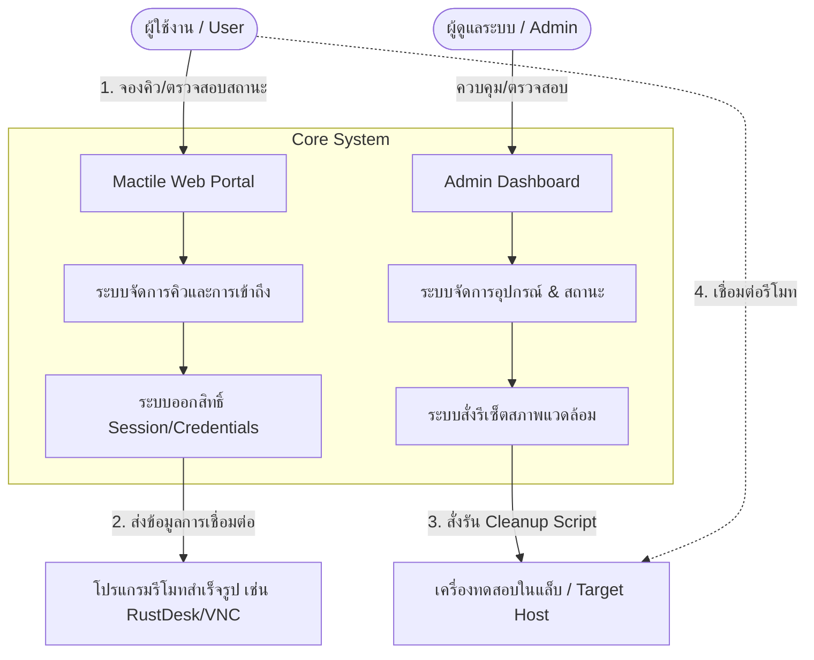
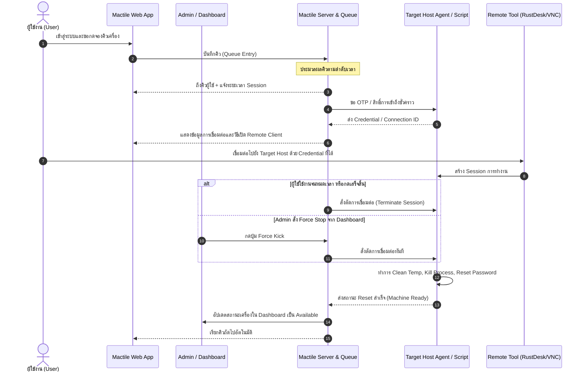

# Project Charter: Mactile (กลุ่ม 4) — MVP

> **โครงการ:** Mactile (ระบบบริหารจัดการคิวและอุปกรณ์รีโมทห้องแล็บ)  
> **กลุ่มผู้พัฒนา:** กลุ่ม 4  
> **ระดับโครงการ:** Minimum Viable Product (MVP)  
> **สถานะเอกสาร:** ฉบับร่างสมบูรณ์ (Draft / Active)  
> **วันที่จัดทำ:** 16 สิงหาคม 2026  

---

## 1. ข้อมูลทั่วไปของโครงการ (Project Overview)

| หัวข้อ | รายละเอียด |
| :--- | :--- |
| **ชื่อโครงการ** | **Mactile** |
| **กลุ่มที่รับผิดชอบ** | กลุ่ม 4 |
| **ขอบเขตการพัฒนา** | Minimum Viable Product (MVP) |
| **เป้าหมายหลัก** | สร้างระบบควบคุมการจองคิว เข้าถึงเครื่องทดสอบ/เวิร์กสเตชันจากระยะไกล รีเซ็ตสภาพแวดล้อม และมีแดชบอร์ดสำหรับผู้ดูแล |
| **กลุ่มผู้ใช้งานหลัก** | ผู้ใช้งานทั่วไป/นักศึกษา/นักพัฒนา (Users) และ ผู้ดูแลระบบห้องปฏิบัติการ (Admins) |

---

## 2. ที่มาและความสำคัญ (Background & Problem Statement)

### 2.1 ปัญหาในปัจจุบัน (Current Pain Points)
1. **การแย่งใช้งานเครื่องและการจัดสรรเวลาที่ไม่เป็นธรรม:** ผู้ใช้งานไม่ทราบว่าเครื่องว่างหรือไม่ หรือเกิดการใช้งานทับซ้อนกัน ขาดระบบจองคิวที่โปร่งใส
2. **สภาพแวดล้อมของเครื่องปนเปื้อน (Environment Pollution):** ผู้ใช้งานคนก่อนหน้าทิ้งไฟล์ ข้อมูลส่วนตัว รหัสผ่าน หรือแอปพลิเคชันค้างไว้ ทำให้ผู้ใช้คนถัดไปประสบปัญหาหรืออาจเกิดช่องโหว่ด้านความปลอดภัย
3. **ความยุ่งยากในการเชื่อมต่อระยะไกล:** ขาดจุดศูนย์กลางในการรับ Credential หรือ Session Link สำหรับเข้าใช้งานเครื่อง
4. **ผู้ดูแลระบบขาดการมองเห็นภาพรวม (Lack of Visibility):** Admin ไม่สามารถตรวจสอบได้ว่าเครื่องใดกำลังถูกใช้งาน มีใครรอคิวอยู่ หรือไม่สามารถตัดการเชื่อมต่อกรณีใช้งานเกินเวลาได้ทันที

### 2.2 โอกาสและแนวทางแก้ไข (Solution Concept)
โครงการ **Mactile (MVP)** พัฒนาขึ้นมาเพื่อทำหน้าที่เป็น **Centralized Remote Lab Management Platform** ที่ประสานการจองคิว จัดการสิทธิ์การเข้าถึงผ่านโปรแกรมรีโมทสำเร็จรูปที่มีความเสถียรสูง และสั่งรันสคริปต์รีเซ็ตเครื่องหลังจบการใช้งาน พร้อมหน้า Dashboard บริหารจัดการสำหรับ Admin

---

## 3. วัตถุประสงค์ของโครงการ (Project Objectives)

1. **ระบบจองคิวและการเข้าถึง (Queue & Access Management):** เพื่อให้ผู้ใช้สามารถตรวจสอบสถานะเครื่อง จองช่วงเวลา หรือต่อคิวรับสิทธิ์เข้าใช้งานได้อย่างเป็นระบบและอัตโนมัติ
2. **การรีเซ็ตสภาพแวดล้อมเบื้องต้น (Basic Environment Reset & Cleanup):** เพื่อให้เครื่องทดสอบกลับสู่สภาพแวดล้อมเริ่มต้นที่สะอาด ปลอดภัย และพร้อมสำหรับผู้ใช้คนถัดไปทุกครั้ง
3. **การเชื่อมต่อรีโมทด้วยโปรแกรมสำเร็จรูป (Remote Connection via Existing Tools):** เพื่อลดความซับซ้อนในการพัฒนา โดยนำโปรแกรมรีโมทมาตรฐานที่เชื่อถือได้ (เช่น RustDesk, VNC, AnyDesk หรือ Screen Sharing) มาบูรณาการร่วมกับระบบสิทธิ์และการแจก Session Access
4. **หน้า Dashboard ผู้ดูแลระบบ (Admin Dashboard):** เพื่อให้ผู้ดูแลระบบสามารถตรวจสอบสถานะเครื่อง คิวการใช้งาน จัดการสิทธิ์ และสั่งรีเซ็ตเครื่องแบบ Manual หรือ Override ได้อย่างสะดวก

---

## 4. ขอบเขตของโครงการ (Project Scope - MVP)

### 4.1 ฟังก์ชันการทำงานหลัก (Core MVP Features)

#### 1) ระบบจองคิวและการเข้าถึง (Queue & Access Management)
- **การแสดงสถานะเครื่อง:** ตรวจสอบสถานะของเครื่องในระบบ (Available, Busy, Cleaning/Resetting, Offline)
- **การต่อคิวและการจอง:** ผู้ใช้สามารถกดจองคิวหรือเลือก Slot เวลาใช้งานที่กำหนดได้
- **ระบบจัดสรรคิว (FIFO / Time-slot):** ระบบแจ้งเตือนเมื่อถึงคิว พร้อมระบุระยะเวลาที่สามารถใช้งานได้ (Session Timeout)
- **การส่งมอบการเข้าถึง (Access Handover):** สร้างหรือส่งมอบ Access Token / Password ชั่วคราว หรือ Dynamic Connection ID สำหรับผู้ที่ถึงคิว

#### 2) การจัดการและรีเซ็ตสภาพแวดล้อมเบื้องต้น (Environment Management & Basic Reset)
- **Automatic Post-Session Cleanup:** เมื่อหมดเวลาใช้งาน ระบบจะสั่งตัดการเชื่อมต่อและเรียกใช้งาน Cleanup Script
- **Basic Reset Tasks:**
  - ล้างไฟล์ในโฟลเดอร์ชั่วคราว (Downloads, Desktop, Temp files ของ Guest/User Profile)
  - ปิดโปรแกรมและ Kill Processes ที่ผู้ใช้เปิดทิ้งไว้
  - เคลียร์ Cache และ Session เบราว์เซอร์ชั่วคราว
  - เปลี่ยน/รีเซ็ตรหัสผ่านชั่วคราวสำหรับการรีโมท
- **Health Check เบื้องต้น:** ตรวจสอบสถานะการเชื่อมต่อเครือข่ายและสถานะความพร้อมของเครื่องก่อนปล่อยคิวถัดไป

#### 3) การเชื่อมต่อรีโมทด้วยโปรแกรมสำเร็จรูป (Remote Connection via Existing Tools)
- บูรณาการกับโปรแกรมรีโมทสำเร็จรูปที่มีอยู่แล้ว เช่น **RustDesk (Self-hosted/Public)**, **VNC (TigerVNC/TightVNC/macOS Screen Sharing)** หรือ **AnyDesk**
- ระบบจัดการ Credential/One-Time Password (OTP) ชั่วคราว เพื่อให้ผู้ใช้เข้าถึงผ่าน Client ของโปรแกรมนั้นๆ ได้โดยตรง
- มีคำแนะนำและลิงก์ดาวน์โหลด Client หรือการตั้งค่าการเชื่อมต่อที่เข้าใจง่าย

#### 4) หน้า Dashboard สำหรับผู้ดูแลระบบ (Admin Dashboard)
- **Live Device Monitoring:** ดูสถานะเครื่องทั้งหมดในระบบแบบ Real-time / Near Real-time
- **Queue & Active Session Control:**
  - ดูรายชื่อผู้ใช้ที่กำลังใช้งาน และผู้ที่รออยู่ในคิว
  - ปุ่มสั่งยุติ Session (Force Terminate/Kick)
  - ปุ่มสั่งเลื่อนคิวหรือยกเลิกคิวกรณีผู้ใช้ไม่มารายงานตัว
- **Manual Maintenance & Override:**
  - ปุ่มสั่งรัน Reset Script ทันที (Force Reset)
  - เปลี่ยนสถานะเครื่องเป็น Maintenance Mode (ปิดรับคิวชั่วคราว)
- **Activity Logs:** บันทึกประวัติการใช้งาน ประวัติการจอง และ Log การรีเซ็ตเครื่อง

---

### 4.2 สิ่งที่อยู่นอกเหนือขอบเขตในเฟส MVP (Out of Scope for MVP)
- การสร้าง Remote Protocol หรือเขียน Video Streaming Client ขึ้นมาเองจากศูนย์
- การทำ Bare-metal OS Re-imaging อัตโนมัติ (เช่น PXE boot re-install ทุกรอบ)
- ระบบชำระเงิน (Payment Gateway) และการคำนวณค่าบริการเชิงพาณิชย์
- การรองรับระบบ Multi-tenant สำหรับหลายสถาบันหรือหลายสาขาในระดับซับซ้อน

---

## 5. แผนภาพลำดับการทำงาน (Workflow & Sequence Diagram)

---

## 6. สถาปัตยกรรมและเครื่องมือทางเทคนิค (Proposed Tech Stack)

| ส่วนประกอบ | เทคโนโลยี / เครื่องมือที่แนะนำ | หน้าที่และบทบาท |
| :--- | :--- | :--- |
| **Frontend** | HTML5, CSS, Vanilla JS / React หรือ Vue.js | หน้าเว็บจองคิว แสดงสถานะ และ Admin Dashboard |
| **Backend API** | Node.js (Express / Fastify) หรือ Python (FastAPI) | จัดการ Business Logic, Queue Engine, Authen และ API |
| **Database** | SQLite / PostgreSQL หรือ Redis | เก็บข้อมูลผู้ใช้, รายการคิว, ข้อมูลเครื่อง และ Session State |
| **Remote Software** | RustDesk / VNC Server / AnyDesk | ซอฟต์แวร์สำเร็จรูปสำหรับส่งภาพหน้าจอและรับ Input |
| **Host Automation** | Python Script / Bash / PowerShell / OS Agent | สคริปต์ประจำเครื่องสำหรับรับคำสั่ง Clean up, Reset และ Health check |

---

## 7. เกณฑ์การวัดผลความสำเร็จและเกณฑ์การยอมรับ (Acceptance Criteria & KPIs)

> [!IMPORTANT]
> **เกณฑ์การยอมรับของ MVP (Acceptance Criteria):**
> 1. ผู้ใช้สามารถล็อกอิน ดูสถานะเครื่อง และกดจองคิวหรือเข้าคิวได้สำเร็จ
> 2. เมื่อถึงคิว ผู้ใช้ได้รับข้อมูลการเชื่อมต่อ (ID/Password/URL) และสามารถรีโมทเข้าเครื่องผ่านโปรแกรมสำเร็จรูปได้จริง
> 3. เมื่อหมดเวลาหรือสิ้นสุด Session ระบบสามารถตัดการเชื่อมต่อและรันสคริปต์รีเซ็ตไฟล์/โปรแกรมเบื้องต้นได้
> 4. ผู้ดูแลระบบสามารถดูสถานะ Real-time บน Dashboard และมีปุ่มสั่งบังคับรีเซ็ต/ตัด Session ได้
> 5. เครื่องพร้อมรองรับคิวถัดไปได้โดยไม่ต้องมีเจ้าหน้าที่ไปกดที่หน้าเครื่องจริง

### เป้าหมายเชิงตัวเลข (Target KPIs)
- **เวลาในการรีเซ็ตเครื่อง (Reset Cycle Time):** ไม่เกิน 1-2 นาทีหลังจบ Session
- **ความถูกต้องในการจัดสรรคิว (Queue Accuracy):** 100% ไม่เกิดการปล่อยคิวซ้อนทับกันในเครื่องเดียวกัน
- **ความง่ายในการเชื่อมต่อ (Usability):** ผู้ใช้สามารถเริ่มรีโมทได้ภายใน 3 ขั้นตอนหลังได้รับสิทธิ์

---

## 8. โครงสร้างทีมและบทบาทหน้าที่ (Roles & Responsibilities - กลุ่ม 4)

| บทบาท (Role) | สมาชิกที่รับผิดชอบ | หน้าที่หลัก (Key Responsibilities) |
| :--- | :--- | :--- |
| **Project Lead & Architecture** | ทีมกลุ่ม 4 | ควบคุมทิศทางโครงการ, ออกแบบ System Flow และประสานงานภาพรวม |
| **Frontend & UI/UX** | ทีมกลุ่ม 4 | ออกแบบและพัฒนา User Queue Portal และ Admin Dashboard ให้ใช้งานง่าย |
| **Backend & Queue Engine** | ทีมกลุ่ม 4 | พัฒนา API, ระบบฐานข้อมูล, Logic การจัดการคิว และระบบแจกแจงสิทธิ์ |
| **Host Script & Remote Integration** | ทีมกลุ่ม 4 | พัฒนาสคริปต์ Reset/Cleanup บนเครื่อง Target, เชื่อมต่อโปรแกรมรีโมทสำเร็จรูป |
| **QA & Documentation** | ทีมกลุ่ม 4 | ทดสอบระบบแบบ End-to-End, จัดทำคู่มือและรายงานสรุปโครงการ |

---

## 9. การวิเคราะห์ความเสี่ยงและแนวทางแก้ไข (Risk Management)

| ความเสี่ยง (Risk) | ผลกระทบ | โอกาสเกิด | แนวทางป้องกันและแก้ไข (Mitigation Plan) |
| :--- | :---: | :---: | :--- |
| **1. โปรแกรมรีโมทสำเร็จรูปตัดการเชื่อมต่อหรือ Session ค้าง** | สูง | ปานกลาง | มีสคริปต์ Agent บนเครื่องคอยตรวจจับ Process และสั่ง Restart Service รีโมทเมื่อจบ Session |
| **2. ผู้ใช้งานสร้างไฟล์ขนาดใหญ่หรือแก้ไขการตั้งค่าระบบลึก** | ปานกลาง | ปานกลาง | กำหนดสิทธิ์บัญชีผู้ใช้รีโมทเป็น Standard/Guest User (จำกัดสิทธิ์ Admin) และมีสคริปต์ล้าง Temp Folder เฉพาะจุด |
| **3. สภาพแวดล้อมเครื่องไม่คืนค่าเดิม 100%** | ปานกลาง | ต่ำ | จัดทำ Check-list ของรายการที่จะ Reset ให้ชัดเจน และมีปุ่ม Force Re-run บน Dashboard ให้ Admin สั่งซ้ำได้ |
| **4. ผู้ใช้ไม่เข้าใช้งานตามเวลาที่จอง (No-show)** | ต่ำ | สูง | กำหนดระบบ Timeout ยกเลิกคิวอัตโนมัติหากไม่เชื่อมต่อภายใน 5-10 นาที แล้วส่งสิทธิ์ให้คิวถัดไป |

---

## 10. แผนการดำเนินงานและเป้าหมายส่งมอบ (Milestones & Timeline)

| เฟส (Phase) | รายละเอียดงาน (Deliverables) | ระยะเวลาโดยประมาณ |
| :--- | :--- | :---: |
| **Phase 1: Design & Setup** | - จัดทำ Project Charter, ออกแบบ UI Mockup, กำหนด Data Schema - ทดสอบโปรแกรมรีโมทสำเร็จรูปและเขียน Prototype สคริปต์ Cleanup | สัปดาห์ที่ 1 - 2 |
| **Phase 2: Core Development** | - พัฒนาระบบคิว (Queue Management) และ API เชื่อมต่อ - พัฒนาสคริปต์ Reset & Agent ประจำเครื่อง - พัฒนาหน้าเว็บ User Interface และ Admin Dashboard | สัปดาห์ที่ 3 - 5 |
| **Phase 3: Integration & Testing** | - เชื่อมต่อระบบทั้งหมดเข้าด้วยกัน (Web + Backend + Remote + Agent) - ทดสอบ End-to-End Workflow และแก้บั๊ก | สัปดาห์ที่ 6 - 7 |
| **Phase 4: Deployment & Final Report** | - นำระบบขึ้นทดสอบใช้งานจริงในห้องแล็บ - สรุปผลการประเมิน จัดทำคู่มือการใช้งานและเอกสารส่งมอบ | สัปดาห์ที่ 8 |

---

> [!NOTE]
> เอกสารฉบับนี้เป็นข้อตกลงและกรอบการดำเนินงานสำหรับการพัฒนา **Mactile (กลุ่ม 4) MVP** ขอบเขตและรายละเอียดสามารถปรับเปลี่ยนได้ตามความเหมาะสมผ่านการพิจารณาของทีมงานและผู้เกี่ยวข้อง
