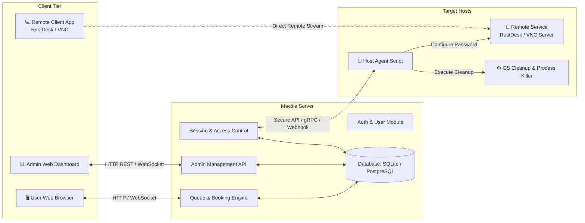
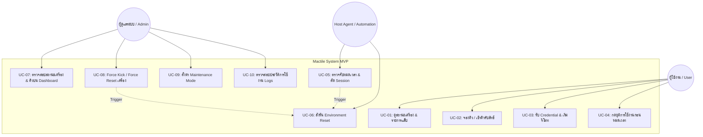
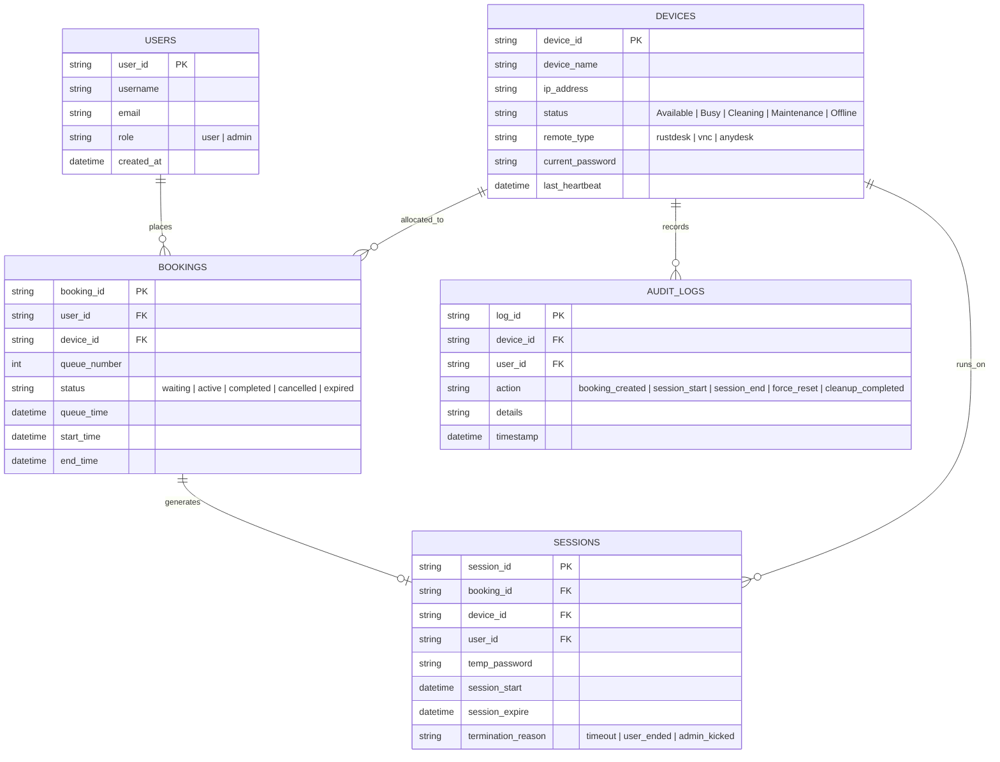

# Software Requirements Specification (SRS): Mactile (กลุ่ม 4) — MVP

> **ชื่อระบบ:** Mactile (Remote Device Lab & Queue Management System)  
> **กลุ่มผู้พัฒนา:** กลุ่ม 4  
> **เวอร์ชันเอกสาร:** 1.0 (MVP)  
> **สถานะ:** Approved / Active  
> **วันที่จัดทำ:** 16 สิงหาคม 2026  

---

## 1. บทนำ (Introduction)

### 1.1 วัตถุประสงค์ของเอกสาร (Purpose)
เอกสารฉบับนี้จัดทำขึ้นเพื่อระบุข้อกำหนดความต้องการทางซอฟต์แวร์ (Software Requirements Specification: SRS) ของระบบ **Mactile (เวอร์ชัน MVP)** สำหรับกลุ่ม 4 โดยมีเป้าหมายเพื่อเป็นพิมพ์เขียว (Blueprint) และข้อตกลงร่วมกันระหว่างทีมพัฒนา ผู้ดูแลระบบ และผู้มีส่วนได้ส่วนเสีย สำหรับการออกแบบ พัฒนา และทดสอบระบบ

### 1.2 ขอบเขตของระบบ (System Scope)
ระบบ **Mactile** เป็นระบบศูนย์กลางในการบริหารจัดการการจองคิว การควบคุมสิทธิ์การเข้าถึงเครื่องคอมพิวเตอร์/เครื่องทดสอบระยะไกล (Target Host) การส่งมอบช่องทางเชื่อมต่อผ่านโปรแกรมรีโมทสำเร็จรูป การสั่งรีเซ็ตและทำความสะอาดสภาพแวดล้อมเครื่องโดยอัตโนมัติหลังสิ้นสุดการใช้งาน และการมอนิเตอร์สถานะผ่าน Admin Dashboard

### 1.3 คำจำกัดความและคำศัพท์เฉพาะ (Definitions, Acronyms & Abbreviations)

| คำศัพท์ / ตัวย่อ | ความหมาย |
| :--- | :--- |
| **Target Host / Device** | เครื่องคอมพิวเตอร์หรือเวิร์กสเตชันในห้องแล็บที่เปิดให้ผู้ใช้รีโมทเข้ามาใช้งาน |
| **Host Agent** | สคริปต์หรือโปรแกรมเบื้องหลังที่ติดตั้งบน Target Host ทำหน้าที่สื่อสารกับ Server, สั่ง Reset และจัดการ Credential |
| **Remote Tool** | โปรแกรมสำเร็จรูปที่ใช้ส่งภาพหน้าจอและควบคุมเครื่องระยะไกล เช่น RustDesk, TigerVNC, AnyDesk |
| **Session** | ช่วงเวลาที่ผู้ใช้ได้รับอนุญาตให้เชื่อมต่อและควบคุม Target Host ได้อย่างถูกต้องตามคิว |
| **OTP / Session Credential** | รหัสผ่านหรือ Token ชั่วคราวที่ถูกสุ่มขึ้นมาสำหรับ Session นั้นๆ และจะถูกทำลายเมื่อสิ้นสุดการใช้งาน |
| **FIFO (First-In, First-Out)** | ลำดับการจัดคิวแบบมาก่อน-ได้ก่อน |

---

## 2. ภาพรวมของระบบ (Overall Description)

### 2.1 ผังโครงสร้างการทำงานภาพรวม (High-Level Architecture)

### 2.2 บทบาทและสิทธิ์ของผู้ใช้งาน (User Roles & Personas)

1. **ผู้ใช้งานทั่วไป (General User / Student / Developer):**
   - ดูรายการเครื่องทดสอบและสถานะปัจจุบัน
   - กดรับคิวใช้งาน (Join Queue) หรือจองช่วงเวลาล่วงหน้า (Slot Booking)
   - ตรวจสอบลำดับคิวและเวลานับถอยหลังของตนเอง
   - รับ Credential/Connection Link เมื่อถึงคิว และเปิดใช้งานผ่าน Remote Client
   - กดยุติ Session ก่อนเวลาเมื่อใช้งานเสร็จสิ้น

2. **ผู้ดูแลระบบ (System Administrator / Lab Admin):**
   - ล็อกอินเข้าสู่ระบบ Admin Dashboard
   - ดูภาพรวมสถานะเครื่องทั้งหมดในระบบแบบ Real-time (Available, Busy, Cleaning, Offline)
   - ตรวจสอบรายการคิวที่กำลังรอ และ Active Sessions
   - สั่งคำสั่งฉุกเฉิน (Force Disconnect, Force Kick User, Force Reset Machine)
   - เปิด-ปิดเครื่องเข้าสู่โหมดปรับปรุง (Maintenance Mode)
   - ดูบันทึกการใช้งาน (Audit Logs & Session History)

---

## 3. ผังกรณีการใช้งาน (Use Case Diagram)

---

## 4. ข้อกำหนดเชิงหน้าที่ (Functional Requirements)

### 4.1 โมดูลที่ 1: ระบบการจองคิวและการเข้าถึง (Queue & Access Management)

| รหัสข้อกำหนด | รายละเอียดข้อกำหนด (Requirement Description) | ความสำคัญ |
| :--- | :--- | :---: |
| **FR-QUE-001** | ระบบต้องแสดงรายการ Target Host ทั้งหมด พร้อมสถานะความพร้อมแบบ Real-time (`Available`, `Busy`, `Cleaning`, `Maintenance`, `Offline`) | **Must Have** |
| **FR-QUE-002** | ผู้ใช้ที่ยืนยันตัวตนแล้วสามารถกดเข้าคิว (FIFO Queue) หรือเลือกช่วงเวลาที่เปิดให้จองได้ | **Must Have** |
| **FR-QUE-003** | ระบบต้องป้องกันไม่ให้ผู้ใช้คนเดิมกดจองคิวเครื่องเดียวกันซ้ำซ้อนในเวลาเดียวกัน | **Must Have** |
| **FR-QUE-004** | ระบบต้องแสดงตำแหน่งคิวปัจจุบัน (Queue Position) และเวลาโดยประมาณที่ต้องรอ (Estimated Wait Time) ให้ผู้ใช้เห็น | **Must Have** |
| **FR-QUE-005** | เมื่อถึงคิวของผู้ใช้ ระบบต้องแจ้งเตือนผ่านหน้าเว็บ และให้เวลารายงานตัว (Claim Timeout) ภายใน 3-5 นาที หากไม่รายงานตัวจะทำการข้ามคิวทันที | **Must Have** |
| **FR-QUE-006** | ระบบต้องกำหนดระยะเวลาใช้งานสูงสุดต่อ Session (เช่น 30 หรือ 60 นาที) พร้อมมีตัวนับเวลาถอยหลัง (Countdown Timer) แสดงบนหน้าจอผู้ใช้ | **Must Have** |
| **FR-QUE-007** | ผู้ใช้สามารถกดยุติการใช้งานก่อนกำหนด (End Session Early) เพื่อคืนเครื่องให้กับคิวถัดไปได้ | **Should Have** |

---

### 4.2 โมดูลที่ 2: การจัดการและรีเซ็ตสภาพแวดล้อมเบื้องต้น (Environment Management & Basic Reset)

| รหัสข้อกำหนด | รายละเอียดข้อกำหนด (Requirement Description) | ความสำคัญ |
| :--- | :--- | :---: |
| **FR-ENV-001** | เมื่อ Session สิ้นสุด (หมดเวลา, ผู้ใช้กดเสร็จสิ้น หรือ Admin สั่ง Kick) ระบบต้องสั่งตัดสัญญาณรีโมททันที และเปลี่ยนสถานะเครื่องเป็น `Cleaning` | **Must Have** |
| **FR-ENV-002** | Host Agent ต้องรันสคริปต์กวาดล้างไฟล์ชั่วคราว ได้แก่ โฟลเดอร์ Downloads, Desktop, Recycle Bin/Trash และ Temp files ของ Guest User | **Must Have** |
| **FR-ENV-003** | Host Agent ต้องสั่ง Kill Processes ของแอปพลิเคชันที่ผู้ใช้เปิดค้างไว้ (เช่น Web Browser, IDE, Terminal, Background Tasks) | **Must Have** |
| **FR-ENV-004** | Host Agent ต้องล้าง Cache, History และ Saved Passwords ของเว็บเบราว์เซอร์หลักในเครื่อง | **Should Have** |
| **FR-ENV-005** | Host Agent ต้องทำการสุ่มเปลี่ยนรหัสผ่านการเชื่อมต่อรีโมทใหม่ (Rotate Remote Password) เพื่อไม่ให้ผู้ใช้เดิมนำรหัสเก่ามารีโมทซ้ำได้ | **Must Have** |
| **FR-ENV-006** | Host Agent ต้องส่งสัญญาณ Health Check และ Reset Completion Status กลับมายัง Server เพื่อเปลี่ยนสถานะเครื่องเป็น `Available` ให้คิวถัดไป | **Must Have** |
| **FR-ENV-007** | หากสคริปต์ Reset ล้มเหลวหรือไม่ตอบสนองภายในเวลาที่กำหนด (Timeout 2 นาที) ระบบต้องเปลี่ยนสถานะเครื่องเป็น `Error/Maintenance` และแจ้งเตือน Admin | **Should Have** |

---

### 4.3 โมดูลที่ 3: การเชื่อมต่อรีโมทด้วยโปรแกรมสำเร็จรูป (Remote Connection Integration)

| รหัสข้อกำหนด | รายละเอียดข้อกำหนด (Requirement Description) | ความสำคัญ |
| :--- | :--- | :---: |
| **FR-REM-001** | ระบบต้องรองรับการเชื่อมต่อผ่านโปรแกรมรีโมทสำเร็จรูปมาตรฐานที่มีอยู่แล้ว (เช่น RustDesk, VNC หรือ AnyDesk) | **Must Have** |
| **FR-REM-002** | เมื่อถึงคิวใช้งาน ระบบต้องแสดงข้อมูล Connection Details (Target Host ID/IP, Port, และ Temporary Password / One-Time Token) ให้เฉพาะผู้ใช้เจ้าของคิว | **Must Have** |
| **FR-REM-003** | ระบบต้องมีปุ่มคัดลอกข้อมูลการเชื่อมต่อ (Copy Credentials) และคำแนะนำขั้นตอนการเปิดแอปพลิเคชัน Client อย่างชัดเจน | **Should Have** |
| **FR-REM-004** | ระบบต้องรองรับ Deep Link หรือ Click-to-Connect URL (ถ้าโปรแกรม Remote Client รองรับ) เพื่อให้ผู้ใช้กดเปิดโปรแกรมรีโมทได้ใน 1 คลิก | **Could Have** |
| **FR-REM-005** | รหัสผ่านการรีโมท (Remote Password) จะต้องถูกสร้างแบบ Dynamic และถูกยกเลิก/เปลี่ยนแปลงทันทีหลังจบ Session | **Must Have** |

---

### 4.4 โมดูลที่ 4: หน้า Dashboard สำหรับผู้ดูแลระบบ (Admin Dashboard)

| รหัสข้อกำหนด | รายละเอียดข้อกำหนด (Requirement Description) | ความสำคัญ |
| :--- | :--- | :---: |
| **FR-ADM-001** | ระบบต้องมีหน้า Admin Login แยกต่างหากพร้อมการตรวจสอบสิทธิ์ระดับผู้ดูแล | **Must Have** |
| **FR-ADM-002** | Dashboard ต้องแสดงภาพรวมสถานะอุปกรณ์ทั้งหมด (Device Cards: ชื่อเครื่อง, IP, สถานะปัจจุบัน, ผู้ใช้งานขณะนั้น, เวลาคงเหลือ) | **Must Have** |
| **FR-ADM-003** | Dashboard ต้องแสดงรายการคิวทั้งหมดที่รออยู่ พร้อมแสดงลำดับคิวและผู้จอง | **Must Have** |
| **FR-ADM-004** | Admin สามารถกดปุ่ม **Force Kick / Terminate Session** เพื่อตัดการเชื่อมต่อของผู้ใช้ปัจจุบันได้ทันที | **Must Have** |
| **FR-ADM-005** | Admin สามารถกดปุ่ม **Force Reset** เพื่อสั่งให้ Host Agent ดำเนินการ Cleanup สภาพแวดล้อมเครื่องใหม่ได้ทุกเมื่อ | **Must Have** |
| **FR-ADM-006** | Admin สามารถเปลี่ยนสถานะเครื่องเป็น **Maintenance Mode** เพื่อระงับการปล่อยคิวเข้าเครื่องนั้นชั่วคราว | **Must Have** |
| **FR-ADM-007** | Dashboard ต้องแสดง Activity / Audit Logs บันทึกประวัติการจอง, เวลาเริ่ม-สิ้นสุด Session, และประวัติการ Reset | **Should Have** |
| **FR-ADM-008** | Admin สามารถปรับแต่งการตั้งค่าระบบพื้นฐาน เช่น กำหนดระยะเวลา Session เริ่มต้น (Default Session Duration) ได้ | **Could Have** |

---

## 5. ข้อกำหนดที่ไม่ใช่เชิงหน้าที่ (Non-Functional Requirements)

### 5.1 ด้านประสิทธิภาพ (Performance)
- **NFR-PERF-01 (API Response Time):** การตอบสนองของระบบ API สำหรับการจองคิวและการตรวจสอบสถานะต้องไม่เกิน **500 ms** ภายใต้โหลดปกติ
- **NFR-PERF-02 (Reset Duration):** กระบวนการรันสคริปต์ Cleanup และเตรียมความพร้อมเครื่องต้องใช้เวลาไม่เกิน **60-90 วินาที** ต่อรอบ
- **NFR-PERF-03 (State Sync Latency):** การอัปเดตสถานะเครื่องและคิวบนหน้าจอ Dashboard/User Web Portal ต้องอัปเดตอัตโนมัติภายในไม่เกิน **2-3 วินาที** (ผ่าน WebSocket หรือ Short Polling)

### 5.2 ด้านความปลอดภัย (Security & Privacy)
- **NFR-SEC-01 (Credential Isolation):** รหัสผ่านสำหรับการรีโมทต้องเป็นรหัสแบบใช้ครั้งเดียวต่อ Session (Single-session Credential) และถูกทำลายทิ้งทันทีเมื่อหมดเวลา
- **NFR-SEC-02 (Data Privacy):** สคริปต์ Cleanup ต้องลบไฟล์ส่วนบุคคล รหัสผ่าน และ Session Cookie ของผู้ใช้เดิม เพื่อไม่ให้ผู้ใช้คนถัดไปสามารถเข้าถึงข้อมูลได้
- **NFR-SEC-03 (Role-Based Access Control):** การเข้าถึง Endpoint ฝั่ง Admin ทั้งหมดต้องมีการตรวจสอบสิทธิ์ผ่าน JWT หรือ Session Token ที่ปลอดภัย
- **NFR-SEC-04 (Restricted OS Privileges):** บัญชีผู้ใช้งานที่เปิดให้รีโมทเข้าไปใน Target Host ควรเป็นบัญชีแบบ Standard User ที่ไม่มีสิทธิ์แก้ไขการตั้งค่าโครงสร้างระบบ (Root / Administrator)

### 5.3 ด้านความน่าเชื่อถือและความพร้อมใช้งาน (Reliability & Availability)
- **NFR-REL-01 (Heartbeat Monitoring):** Server ต้องส่งสัญญาณตรวจเช็ค Host Agent เป็นระยะ (ทุกๆ 15-30 วินาที) หากไม่ตอบสนองจะปรับสถานะเครื่องเป็น `Offline` อัตโนมัติ เพื่อป้องกันไม่ให้ผู้ใช้จองเครื่องที่ใช้งานไม่ได้
- **NFR-REL-02 (Graceful Error Recovery):** กรณีเครื่อง Target ค้างหรือไม่ตอบสนองคำสั่ง Reset ระบบต้องคงสถานะเครื่องไว้ที่ `Error` และไม่ปล่อยคิวใหม่เข้าไปจนกว่า Admin จะตรวจสอบ

### 5.4 ด้านความง่ายในการใช้งาน (Usability & Design)
- **NFR-USA-01 (Intuitive Flow):** ขั้นตอนการกดจองคิวจนถึงการเปิดโปรแกรมรีโมทต้องมีความเรียบง่าย ไม่ซับซ้อน ไม่เกิน 3 ขั้นตอน
- **NFR-USA-02 (Responsive UI):** หน้าเว็บ User Portal และ Admin Dashboard ต้องแสดงผลได้ถูกต้องบนหน้าจอ Desktop และ Mobile Tablet

---

## 6. โครงสร้างข้อมูลและฐานข้อมูลเบื้องต้น (Data Schema Concept)

---

## 7. รายละเอียดกรณีการใช้งานสำคัญ (Detailed Use Case Specifications)

### 7.1 Use Case: UC-02 & UC-03 การจองคิวและเริ่มใช้งานรีโมท
- **Actor:** ผู้ใช้งานทั่วไป (User)
- **Pre-conditions:** ผู้ใช้เข้าสู่ระบบ Mactile สำเร็จ มีเครื่อง Target Host อยู่ในสถานะ `Available` หรือมีคิวรออยู่
- **Main Flow:**
  1. ผู้ใช้เลือกดูรายการเครื่อง และกดปุ่ม **"จองคิวใช้งาน" (Queue Now)**
  2. ระบบตรวจสอบสถานะ:
     - หากเครื่องว่าง (`Available`): ระบบจัดสรร Session ทันที
     - หากเครื่องมีผู้ใช้อยู่ (`Busy`): ระบบเพิ่มชื่อผู้ใช้เข้าสู่ตารางคิว FIFO และแสดงลำดับคิว
  3. เมื่อถึงคิว ระบบส่งคำสั่งไปยัง Host Agent เพื่อเตรียมรหัสผ่านรีโมทใหม่
  4. ระบบแสดงข้อมูล Connection ID, Password และลิงก์เปิด Remote Tool บนหน้าจอผู้ใช้
  5. ระบบเริ่มนับเวลาถอยหลัง Session (เช่น 30 นาที)
  6. ผู้ใช้เปิดโปรแกรมรีโมทและใส่รหัสผ่านเพื่อเข้าใช้งานเครื่อง Target Host
- **Post-conditions:** เครื่องเปลี่ยนสถานะเป็น `Busy` และ Session เริ่มทำงาน

### 7.2 Use Case: UC-05 & UC-06 การตัดการเชื่อมต่อและรีเซ็ตเครื่องอัตโนมัติ
- **Actor:** ระบบ Mactile (Queue Engine & Host Agent)
- **Pre-conditions:** Session ของผู้ใช้หมดเวลา หรือผู้ใช้กดปุ่ม "สิ้นสุดการใช้งาน"
- **Main Flow:**
  1. ระบบแจ้งเตือนบนหน้าเว็บผู้ใช้ว่า Session สิ้นสุดลงแล้ว
  2. Server ส่งคำสั่ง `EXEC_CLEANUP` ไปยัง Host Agent ประจำเครื่อง
  3. Server อัปเดตสถานะเครื่องเป็น `Cleaning`
  4. Host Agent สั่งตัดการเชื่อมต่อของโปรแกรมรีโมททันที
  5. Host Agent รันคำสั่งกวาดล้าง Temp Files, Downloads, ปิดโปรแกรมค้าง และล้าง Browser History
  6. Host Agent ทำการหมุนเวียนรหัสผ่านใหม่ (Rotate Password)
  7. Host Agent ส่งผลการทำงาน `CLEANUP_SUCCESS` กลับมายัง Server
  8. Server อัปเดตสถานะเครื่องเป็น `Available` และตรวจหาคิวถัดไปในระบบอัตโนมัติ
- **Post-conditions:** เครื่องสะอาด พร้อมให้คิวถัดไปเข้าใช้งานทันที

### 7.3 Use Case: UC-08 การควบคุมฉุกเฉินโดย Admin (Force Kick & Force Reset)
- **Actor:** ผู้ดูแลระบบ (Admin)
- **Pre-conditions:** Admin เข้าสู่หน้า Admin Dashboard
- **Main Flow:**
  1. Admin ดูรายชื่อเครื่องที่กำลังมีการใช้งานผิดปกติ หรือค้าง
  2. Admin กดปุ่ม **"Force Kick & Reset"**
  3. ระบบแสดงหน้าต่างยืนยันคำสั่ง (Confirmation Modal)
  4. เมื่อ Admin ยืนยัน ระบบจะยกเลิก Session ของผู้ใช้ปัจจุบันทันที และบันทึกประวัติว่าถูกสั่งหยุดโดย Admin
  5. Server ส่งคำสั่งด่วนไปยัง Host Agent เพื่อ Kill Process และรันสคริปต์ Cleanup
  6. Dashboard อัปเดตสถานะเครื่องเป็น `Cleaning` จนกว่าจะ Reset เสร็จสิ้น
- **Post-conditions:** ผู้ใช้เดิมถูกตัดออกทันที และเครื่องถูกล้างสภาพแวดล้อมให้กลับมาพร้อมใช้งาน

---

## 8. เมทริกซ์การตรวจสอบย้อนกลับ (Requirements Traceability Matrix)

| รหัสข้อกำหนด (SRS ID) | หัวข้อหลักใน Project Charter | โมดูลที่เกี่ยวข้อง | การทดสอบที่สอดคล้อง |
| :--- | :--- | :--- | :--- |
| **FR-QUE-001 - 007** | 1. ระบบจองคิวและการเข้าถึง | Queue Engine & Web Portal | Test Case: Queue FIFO, Slot Allocation, Timeout Countdown |
| **FR-ENV-001 - 007** | 2. การจัดการและรีเซ็ตสภาพแวดล้อม | Host Agent & OS Automation | Test Case: Temp Folder Wipe, Process Kill, Password Rotation |
| **FR-REM-001 - 005** | 3. การเชื่อมต่อรีโมทด้วยโปรแกรมสำเร็จรูป | Remote Tool Integration | Test Case: Remote Auth, Connection Handshake, Client Launch |
| **FR-ADM-001 - 008** | 4. หน้า Dashboard ผู้ดูแลระบบ | Admin Portal & API | Test Case: Real-time Device Monitor, Force Kick, Audit Logs |
| **NFR-SEC-001 - 004** | ความปลอดภัยและความเป็นส่วนตัว | Core Security & Script | Test Case: Previous User Data Leakage Check, Token Expiration |

---

> [!NOTE]
> เอกสารข้อกำหนดความต้องการนี้ถูกจัดทำขึ้นตามกรอบการพัฒนาของ **กลุ่ม 4 (Mactile MVP)** โดยมุ่งเน้นการส่งมอบระบบที่ทำงานได้จริง เสถียร และปลอดภัย ภายใต้การใช้ซอฟต์แวร์รีโมทสำเร็จรูปเพื่อลดความซ้ำซ้อนในการพัฒนา
